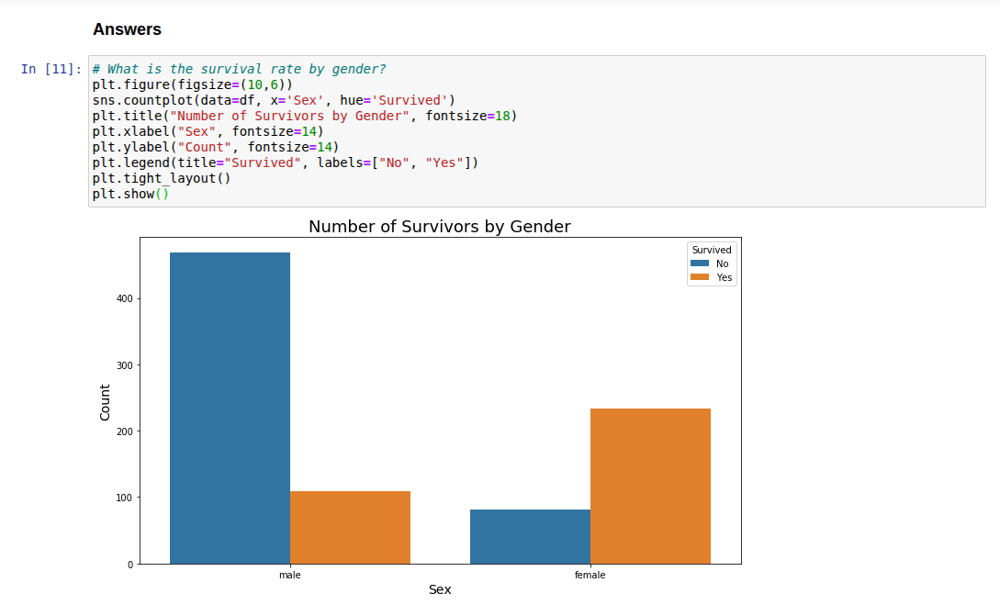

# 🚢 Titanic Survival Prediction

> A machine learning project built to predict passenger survival on the Titanic. Leveraging Python, pandas, seaborn, and scikit-learn — this project focuses on clean preprocessing, insightful data exploration, and model optimization.

---

## 📊 Overview

This project tackles the classic [Titanic dataset](https://www.kaggle.com/competitions/titanic) from Kaggle. The objective is to predict whether a passenger survived or not based on features like age, gender, class, and more.

Key highlights:
- Clean, consistent preprocessing pipeline  
- Feature engineering (titles, age bins, family relationships, etc.)  
- Exploratory data analysis (EDA) with `seaborn` & `matplotlib`  
- Model training and evaluation using `RandomForestClassifier`  
- Hyperparameter tuning with `GridSearchCV`  
- ROC Curve, accuracy, precision, recall & F1 Score

---

## 🛠️ Technologies Used

| Tool | Description |
|------|-------------|
| 🐍 Python | Core programming language |
| 📦 pandas | Data manipulation |
| 📊 seaborn & matplotlib | Data visualization |
| 🧠 scikit-learn | Machine Learning library |
| 📈 GridSearchCV | Hyperparameter tuning |
| 💻 Jupyter Notebook | Interactive coding environment |

---

## 🔍 Exploratory Data Analysis

- Count plots by survival
- Distribution plots of Age, Fare, and Class
- Title extraction from names (Mr, Mrs, etc.)
- Family features (IsAlone, SibSp)

  

---

## 🧪 Feature Engineering

Custom transformations applied:

- **Title extraction**: Consolidated rare titles into groups: Common, Professional, Military, Royal  
- **Age binning**: Grouped into child, teen, young adult, adult, and senior  
- **IsAlone**: Flag to indicate if passenger was traveling alone  
- **Dummy encoding**: One-hot encoding for categorical variables like Embarked and Title

---

## 🧠 Model Training

Used `RandomForestClassifier` as the base model due to its robustness and interpretability. Applied `GridSearchCV` to find optimal hyperparameters:

param_grid = {
    'n_estimators': [200, 400, 500, 1000, 1200, 1500],
    'max_depth': [6, 8, 10, 12],
    'min_samples_split': [2, 4, 6, 8, 10],
    'min_samples_leaf': [1, 2],
    'max_features': [None]
}

---

## 📈 Performance Metrics

**Metrics on Train Set:**  
- Accuracy: 89.45%  
- Precision: 0.89  
- Recall: 0.79  
- F1-Score: 0.85  

**Metrics on Test Set:**  
- Accuracy: 89.00%  
- Precision: 0.89  
- Recall: 0.80  
- F1-Score: 0.84  

---

## 📚 Learnings & Highlights

- Learned how to handle train-test dummy mismatches (e.g. missing categories in test set)
- Reinforced the importance of feature engineering in tabular datasets
- Improved skill in hyperparameter tuning and evaluation metrics

---

## 👨‍💻 Author

Made with ❤️ by [Igor Cenzi](https://github.com/igorcenziai)  
Feel free to connect on [LinkedIn](https://linkedin.com/in/igorcenzi)

---

## ⭐️ If you like this project

Don’t forget to give it a ⭐ on GitHub!  
Feel free to fork, contribute or open issues!
